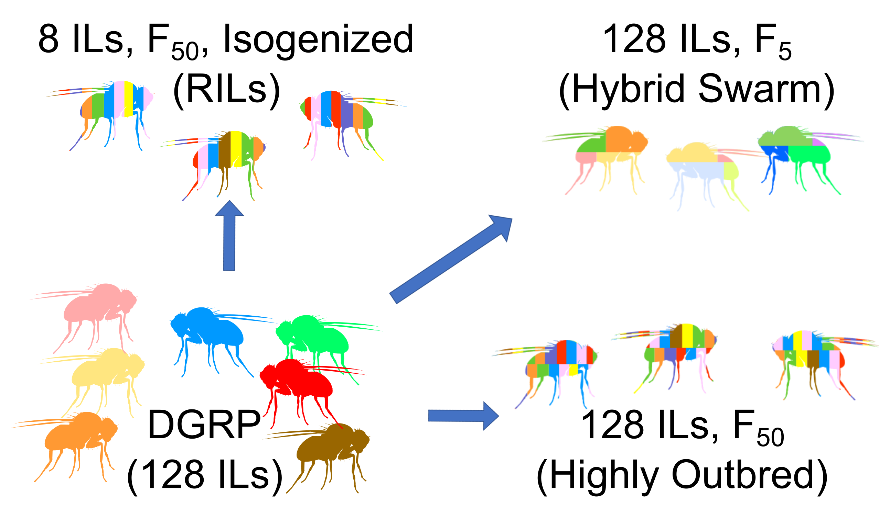
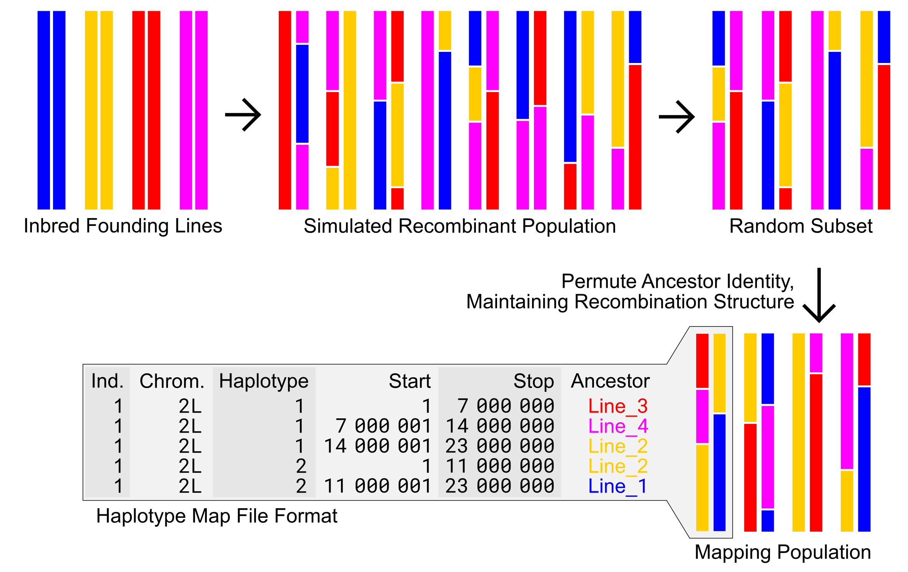
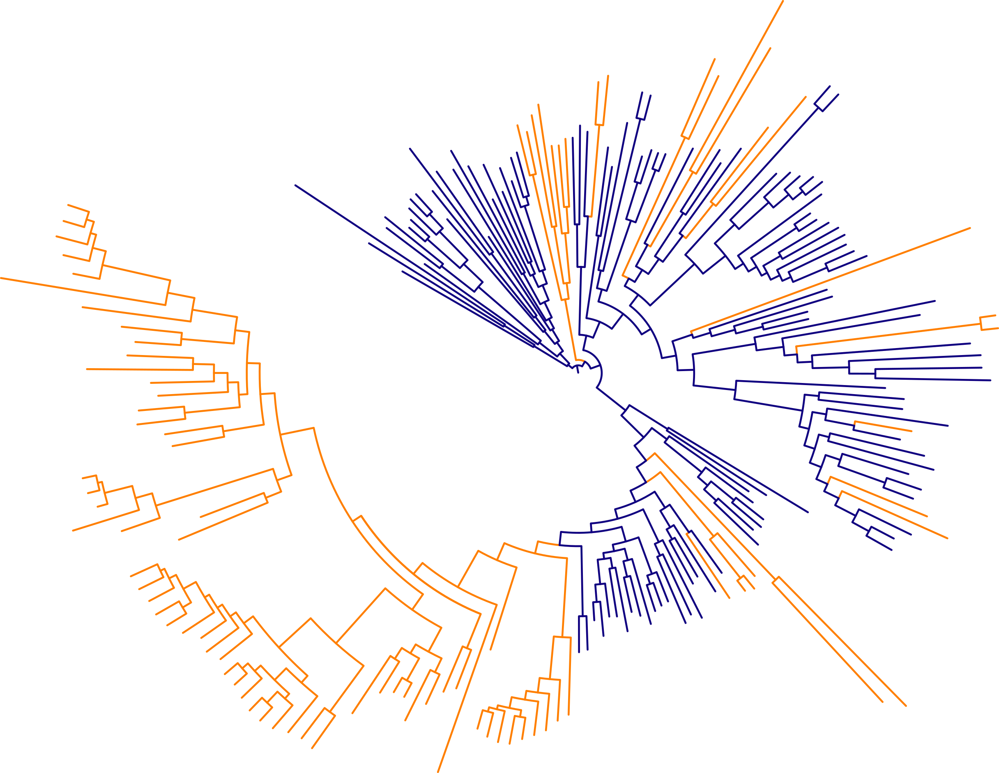

# Research
#### For full detail, see my [CV](assets/docs/CAWeller_CV.pdf)!

#### Bergland labbies at the 2017 Fly Meeting in San Diego

The [Bergland Lab](http://bergland-lab.org/) focuses on the molecular basis of adaptation in the wild, utilizing both Daphnid and Drosophlid model systems. Many genetic association studies test for genotype-phenotype associations in inbred lines. However, inbred lines don’t reflect natural patterns of linkage and heterozygosity, and some interesting aspects of biology can only be addressed in heterozygotes. As a result, we are conducting genetic association studies using *D. melanogaster* **hybrid swarms**: large panmictic populations generated by crossing dozens to hundreds of inbred lines for only a few generations. My research uses hybrid swarm populations to address the following:

1. Can we accurately estimate whole genomes from ultra-low coverage sequence data?
2. How well do hybrid swarms perform in GWAS, compared to other mapping populations?
3. What loci drive allele-specific expressiona and are associated with desiccation resistance?

## Dissertation Projects

### Reconstructing whole genomes from ultra-sparse data
My first goal was to develop a pipeline that can combine ultra-low-coverage (0.05X) hybrid swarm sequencing data with known parental haplotypes to accurately reconstruct whole genomes. The project resulted in a generalized framework that is capable of generating >99.9% accurate genomes for populations with an arbitrarily large number of founding haplotypes. This allows hybrid swarm populations to be genotyped at a fraction of the cost of typical whole genome sequencing.

### Evaluating GWAS power with efficient simulations
We sought to evaluate how well Hybrid Swarm populations fare in a GWAS framework, compared to alternative mapping populations such as inbred lines, recombinant inbred lines, or highly outbred populations. Because we were going to store genotype data and perform association tests across thousands of GWAS simulations, each containing thousands of individuals, commonly-used software and file formats were insufficient.

#### Inbred Lines (the [DGRP](http://dgrp2.gnets.ncsu.edu/) and three derived mapping population designs

In order to simulate thousands of GWAS and retain all genotype information, we leveraged information redundancy due to relatedness in a lossless file format, and improve speed by permutation of haplotype ancestry onto random subsets of modeled recombination blocks.

#### Efficient simulation of Hybrid Swarm populations

### The genetic basis of of desiccation tolerance in *Drosophila melanogaster*
I am applying my pipeline to Drosophila sequencing data to detect genetic variants that drive differential expression (eQTLs) associated with desiccation tolerance. Using roughly 700 reconstructed Hybrid Swarm genomes from an experimental population subjected to starvation conditions, I am evaluating differences in RNA expression profiles between pre-starvation (control) samples and post-starvation survivors. Then, I will intersect this mapping work with genome-wide estimates of allele frequencies across space and time to gain insight into the genetic architecture of rapid and local adaptation.

### Evaluation of a candidate SNP’s effect on desiccation tolerance
Collaborator: Warren Wheaton, an undergraduate who majored in Biology and Economics. Warren parsed preliminary GWAS results and selected a candidate SNP that appears to be associated with desiccation tolerance. Then, he generated two F5 hybrid swarm populations from multiple inbred lines: one hybrid swarm was fixed for the reference allele of the candidate SNP, and the second was fixed for the alternate allele. We measured survivorship every two hours until all flies died four days later, and discovered a highly significant difference in median survival time between the groups.

### Translating the genome reconstruction pipeline to an open-source framework
Collaborators: Ian Rector and Joseph Outten, two undergraduates double-majoring in Biology and Computer Science. As it currently stands, parts of my genome reconstruction pipeline rely on software that is not easily distributable, due to either being licensed software, or extremely difficult to compile. Ian and Joseph are working to implement these parts of the pipeline in an open-source framework using the Julia language. In particular, they are working towards an efficient implementation of the Viterbi algorithm that can interface with standard .VCF files. Their implementation is necessary for an open-source and computationally efficient method of identifying the most likely hidden states (haplotype combinations) while traversing a graph representing a recombinant individual with low-coverage sequencing data.

## Other Research at UVA
### Studying the effect of bacteria spore-formation on evolutionary rate

This project developed from rotation research in [Martin Wu’s lab](http://www.wulabuva.org/), which studies microbial ecology and evolution. A consistent observation across plant and animal species is the presence of an effect of generation time on evolutionary rate. Because most mutations are replication-dependent, and heritable mutations are those in the germ cells, a shorter generation time means more heritable mutations over time. Bacteria that enter a dormant spore state are expected to have effectively longer generation times, and might therefore evolve more slowly. I performed a large-scale phylogenomic analysis to show that spore-forming bacteria (blue lineages in the above tree) evolve more slowly than spore-forming relatives. [[See the article published in Evolution]](assets/docs/Weller_Wu_2015_Evolution.pdf)
