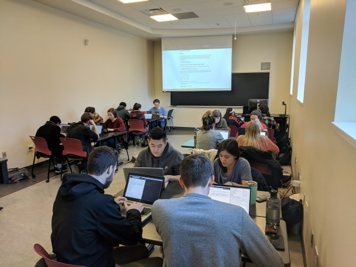
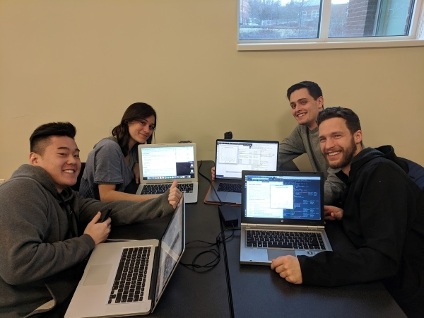
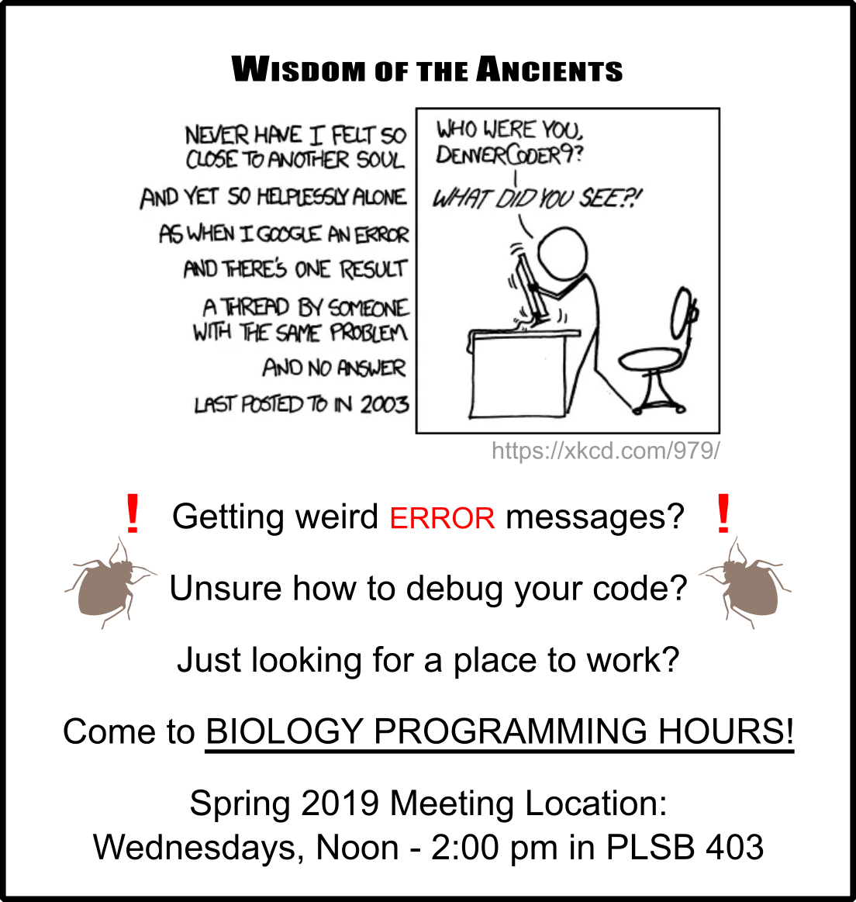

# Teaching
#### For full detail, see my [CV](assets/docs/CAWeller_CV.pdf)!

For as long as I can remember, I've been interested in teaching and training others. Aside from working as a TA, the University of Virginia has provided many teaching-related opportunities through the [Center for Teaching Excellence](https://cte.virginia.edu/):
  * I am enrolled in the [Tomorrow's Professor Today](https://cte.virginia.edu/programs/tomorrow%E2%80%99s-professor-today) program
  * I facilitate yearly teaching workshops for new graduate student TAs
  * I attended the [Course Design Institute](https://cte.virginia.edu/programs/course-design-institute) to prepare teaching my first custom course, Intro to Computational Biology (see below)  

Prior to starting my PhD, I worked as a biomedical instructor for the American Red Cross, where I trained and assessed employees on their procedures.

## Intro to Computational Biology

I'm currently teaching the first course of my own design, **Intro to Computational Biology** as a Distinguished Teaching Fellow at UVA. The course is intended for students who have no programming experience, easing students into using a terminal to manipulate files, and using R to analyze data. See the [**course website**](https://cory-weller.github.io/BIOL4585/) for a closer look!

#### The look of pride for finishing their first GWAS!

## Biology Programming Hours

For the last two years, I’ve hosted a weekly walk-in forum called the *Biology Programming Hours*. It’s a free-form meeting space where people can attend for as much or as little time as they want to discuss programming-related questions. The event is attended by graduate and undergraduate students alike, some coming with specific questions, and others coming just to be part of the community.

#### The current iteration of our flier

## Past Courses
In the past I’ve instructed a summer session of Organismal and Evolutionary Biology, and have taught the lab multiple times. I have also taught lab sections for Human Anatomy & Physiology and Molecular & Cell Biology.
